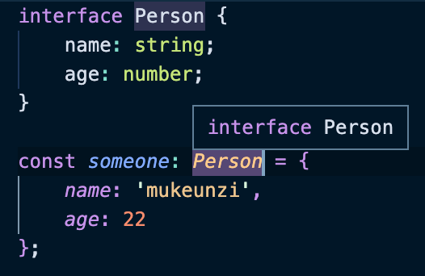
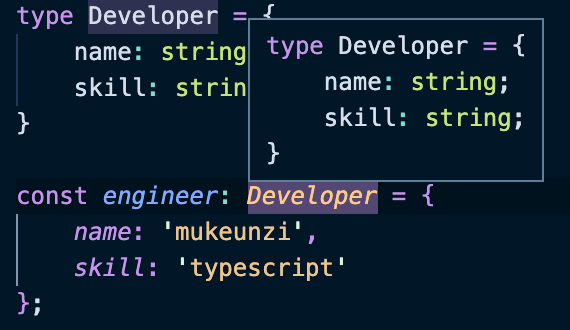

# 5일차

## 타입 별칭

### 타입 별칭의 사용
- 타입 별칭은 특정 타입이나 인터페이스를 참조할 수 있는 타입 변수를 의미합니다. 
```js
// string 타입을 사용할 때
const nickname: string = 'mukeunzi';

// 타입 별칭을 사용할 때
type MyName = string; // string 타입에 MyName이라는 별칭을 부여함
const name: MyName = 'naeunji';
```
- `string, number`와 같이 간단한 타입 뿐만 아니라, `interface`레벨의 복잡한 타입에도 별칭을 부여할 수 있고, 제네릭도 사용할 수 있습니다.

### 타입 별칭의 특징
- 타입 별칭은 새로운 타입 값을 생성하는 것이 아니라, 정의한 타입에 대해 나중에 쉽게 참고할 수 있게 이름을 부여하는 것입니다. 
- 이러한 특징은 VSCode 상의 프리뷰 상태로도 확인할 수 있습니다.
- 아래는 인터페이스로 선언한 타입과, 타입 별칭으로 선언한 타입을 프리뷰로 확인한 결과입니다.

[인터페이스 프리뷰]

[타입 별칭 프리뷰]

- 타입 별칭은 정의한 타입에 대해 쉽게 확인할 수 있습니다. 

### 타입 별칭과 인터페이스의 차이
- 둘의 가장 큰 차이점은 타입의 확장 가능/불가능 여부입니다. 인터페이스를 사용하는 변수는 `extends`를 통해 확장할 수 있는 반면, 타입 별칭은 확장이 불가능합니다. 좋은 소프트웨어는 언제나 확장이 용이해야 한다는 원칙에 따라 인터페이스로 선언해서 사용하는 것을 권장합니다. 