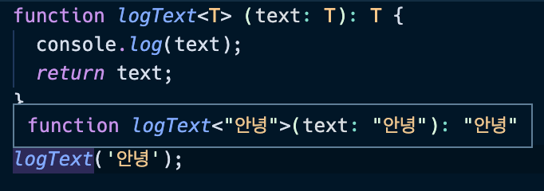
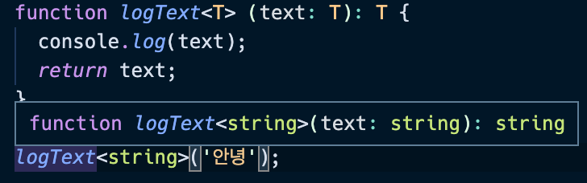
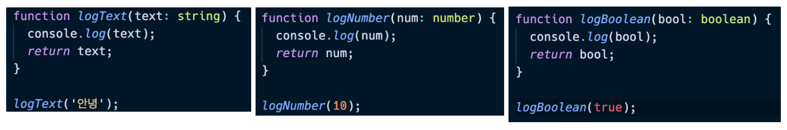
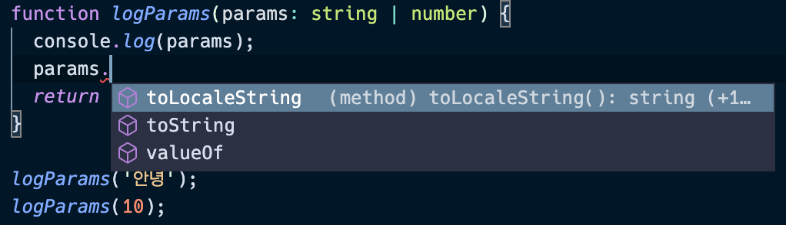

# 9일차

## 제네릭(Generics)

- 제네릭은 C#, Java등의 언어에서 재사용성이 높은 컴포넌트를 만들 때 자주 활용됩니다. 여러가지 타입에서 동작하는 컴포넌트를 생성하는데 사용됩니다.

### 제네릭의 기본 문법
- 제네릭은 함수에 `<{type}>`형식으로 작성합니다.
- 예제 코드를 통해 기본 문법에 대해 살펴보겠습니다.
```js
function logText<T> (text: T): T {
  console.log(text);
  return text;
}

logText('안녕');
```
- 제네릭은 함수를 호출하는 시점에 파라미터의 타입을 지정할 수 있습니다.
 
[제네릭을 지정하지 않았을 때]

- `logText`함수의 프리뷰를 확인해보면 제네릭이 `'안녕'`으로 추론된 것을 확인할 수 있습니다.

[제네릭을 지정했을 때]

- 위 예시처럼 제네릭 타입을 명시적으로도 지정할 수 있습니다.

### 타입 정의 방식의 문제점(함수 중복 선언의)
- 먼저 기존 타입 정의 방식의 문제점을 살펴보겠습니다.
```js
function logText(text) {
  console.log(text);
  return text;
}

logText('안녕');
logText(10);
logText(true);
```
- 위 예시에는 타입을 지정하지 않았기 때문에 암묵적으로 함수의 타입은 `any`로 설정됩니다. 
- 따라서 함수를 호출할 때 어떤 타입의 값을 넘겨도 문제가 되지 않습니다. 
- 하지만 함수 내에서 `split()`메소드를 호출한다고 가정해보겠습니다. 
```js
function logText(text) {
  console.log(text);
  text.split('');
  return text;
}

logText('안녕');
logText(10); // 오류 발생
logText(true); // 오류 발생
```
- 위 메소드는 `string`타입에서만 사용할 수 있기 때문에, 파라미터의 타입은 암묵적으로 `string`으로 설정됩니다. 
- 따라서 `string`타입이 아닌 파라미터를 전달한 코드에서는 오류가 발생합니다.
- 파라미터가 `string`타입이 아니어도 함수가 정상적으로 동작하게 하려면, 타입 별로 함수를 생성해야 합니다. 

[함수의 중복 선언]

- 타입 별로 함수를 따로 선언하는 방법입니다. 위 처럼 코드를 작성하면 중복 코드로 인해 함수가 비대해질 수 있어 유지보수 관점에서 좋지 않습니다. 
- 유니온 타입으로 이를 개선해보겠습니다.

### 유니온 타입을 이용한 선언 방식의 문제점
- 위 코드에 유니온 타입을 적용하면 중복 코드를 줄일 수 있습니다. 하지만 이 또한 문제점이 있습니다.
```js
function logParams(params: string | number) {
  console.log(params);
  return params;
}

logParams('안녕');
logParams(10);
```
- `params`의 타입은 `string`이거나 `number`이기 때문에, 두 타입에서 공통적으로 제공되는 메소드만 사용할 수 있습니다.

[제한적인 메소드 호출]


- 제네릭을 사용해 위 문제를 해결해보겠습니다.

### 제네릭의 장점과 타입 추론의 이점
- 제네릭을 사용해 위 코드를 수정해보겠습니다.
```js
function logText<T>(text: T): T {
  console.log(text);
  return text;
}

const str = logText<string>('안녕'); // `string`으로 타입 추론
str.split('');
const num = logText<number>(1000); // `number`로 타입 추론
num.toLocaleString();
```
- 함수 선언문 `logText<T>(text: T): T`이 의미하는 바는 다음과 같습니다. 
- 함수에서 `T`타입을 사용할 것이고, 파라미터와 리턴 타입도 `T`타입으로 지정합니다. 
- 따라서 함수를 호출할 때 지정하는 타입(`<{type}>`)에 따라 함수의 파라미터와 리턴 타입까지 설정할 수 있습니다. 타입 별로 함수를 선언하지 않아도 됩니다. 
- 제네릭을 사용하면 (1) 타입 정의 방식을 사용했을 때 중복코드가 발생하는 문제점과 (2) 유니온 타입을 사용했을 때 변수의 메소드를 제한적으로 사용할 수 있다는 문제점을 해결할 수 있습니다.

### 인터페이스에 제네릭 사용하기
- 웹 서비스에서 자주 사용되는 드롭박스를 예시로 제네릭을 사용해보겠습니다. 
```js
interface Dropdown<T> {
  value: T;
  selected: boolean;
}

const month: Dropdown<number> = { value: 1, selected: true };
const gender: Dropdown<string> = { value: '여자', selected: true };
```
- 인터페이스에 제네릭을 사용하면, 인터페이스를 사용할 때 마다 여러 타입으로 코드를 재사용할 수 있습니다.
- 제네릭을 사용하면 타입별로 함수를 따로 선언할 때 발생하는 중복코드를 줄일 수 있다는 장점이 있습니다. 

### 제네릭의 타입 제한
```js
function logTextLength<T>(text: T): T {
  console.log(text.length); // 오류 발생
  return text;
}

logTextLength<string>('hi');
```
- 위 코드에서 제네릭을 `string`으로 지정해 `length` API를 사용할 수 있을 것 같지만, 오류가 발생합니다. 함수를 호출할 때 전달하는 제네릭 타입에 따라 `length` API의 사용 여부가 결정되기 때문입니다. 
- `length`를 메소드에서 사용하고싶다면 아래외 같이 코드를 수정해야 합니다.
```js
function logTextLength<T>(text: T[]): T[] {
  console.log(text.length);
  return text;
}

logTextLength<string>(['hi', 'hello']);
```
- 파라미터와 리턴 타입을 배열로 지정했기 때문에, 배열에서 사용할 수 있는 API(메소드)를 모두 사용할 수 있습니다. 

### 제네릭의 타입 제한 - 정의된 타입으로 타입 제한하기
```js
interface LengthType {
  length: number;
}

function logTextLength<T extends LengthType>(text: T): T {
  console.log(text.length);
  return text;
}

logTextLength('hi'); // 정상 동작
logTextLength(10); // 오류 발생
logTextLength({ length: 30 }); // 정상 동작
```
- `extends`키워드를 이용해 제네릭의 타입을 제한할 수 있습니다. 필수로 존재해야 하는 속성을 인터페이스로 정의해준 뒤, 함수 선언 시에 `<T extends {interfaceName}>`형식으로 선언합니다.
- 함수를 호출할 때에는 `length`속성이 존재할 경우에만 정상적으로 코드가 실행됩니다.
- 따라서 예시에서는 `string`타입의 파라미터, 객체의 `length`속성이 있는 경우에만 코드가 정상적으로 동작합니다.