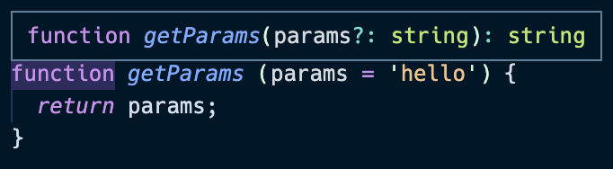
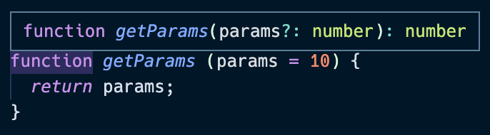

# 10일차

## 타입 추론
- 타입스크립트가 어떻게 타입을 추론하는지에 대해 알아보겠습니다.

### 타입 추론의 기본
- 변수를 선언할 때 타입 선언을 생략하면, 값을 할당하는 과정에서 동적으로 타입이 결정되는데 이를 타입 추론이라고 합니다.
- 타입 추론의 몇 가지 예시를 살펴보겠습니다.

[변수에 값을 할당하지 않았을 때 - any]


- 변수에 값을 할당하지 않으면 `any`로 추론됩니다.

[변수에 값을 할당했을 때]




- 변수에 할당한 값에 따라 타입이 추론되는 것을 알 수 있습니다. 


- 파라미터의 값은 `number`이지만, 함수의 리턴 값은 파라미터 값에 `string`값을 더했습니다. 따라서 리턴 값은 `string`으로 추론됩니다. 

### 인터페이스와 제네릭을 이용한 타입 추론 방식
- 인터페이스와 제네릭을 이용한 타입 추론 방식에 대해 알아보겠습니다. 

[인터페이스와 제네릭을 이용한 타입 추론]


- `Dropdown`인터페이스의 제네릭은 `string`이고, `title`은 타입을 명시한 대로 `string`으로, `value`값의 타입은 제네릭 타입인 `string`으로 추론된 것을 확인할 수 있습니다. 

- 조금 더 복잡한 구조에서의 타입 추론에 대해 살펴보겠습니다.
```js
interface Dropdown<T> {
  title: string;
  value: T;
}

interface DetailedDropdown<K> extends Dropdown<K> {
  description: string;
  tag: K;
}
```
- 제네릭을 사용하는 두 개의 인터페이스를 선언했습니다. 
- `DetailedDropdown<K>`는 `Dropdown<K>`를 상속받고 있습니다. `DetailedDropdown<K>`에서 사용한 제네릭 타입을 `Dropdown<K>`에도 그대로 넘겨주었습니다.
- 위 상속 구조를 코드로 표현하면 다음과 같습니다.
```js
interface DetailedDropdown<K> extends Dropdown<K> {
  description: string;
  tag: K;
  title: string;
  value: K;
}
```
- `DetailedDropdown`와 `Dropdown`에서 제네릭으로 선언된 필드는 같은 타입을 갖습니다. 
```js
interface DetailedDropdown<K> extends Dropdown<K> {
  description: string;
  tag: K;
  title: string;
  value: K;
}

const detailedItem: DetailedDropdown<string> = {
  description: '깔끔합니다',
  tag: '깔끔',
  title: '가방',
  value: '에코백'
}
```
- 따라서 제네릭 타입(`K`)으로 선언된 변수는 모두 같은 타입을 사용해야 합니다.

### Best common type - 타입 추론에 사용하는 알고리즘
- 타입스크립트에서는 배열과 같이 여러 요소의 타입을 추론해야 할 때 `Best common type`이라는 알고리즘을 사용해 타입을 추론합니다. 
```js
const arr1 = [1, 2, null, true]; // {number | null | boolean} 으로 추론
const arr2 = [1, 2, 'result']; // {number | string} 으로 추론
```
- 위와 같이 `Best common type`는 유니온 타입을 사용하여 배열의 모든 요소를 고려하여 모든 값과 호환이 가능하도록 값을 추론합니다. 
